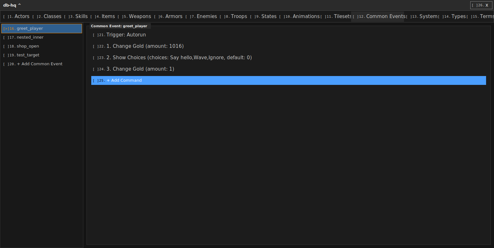
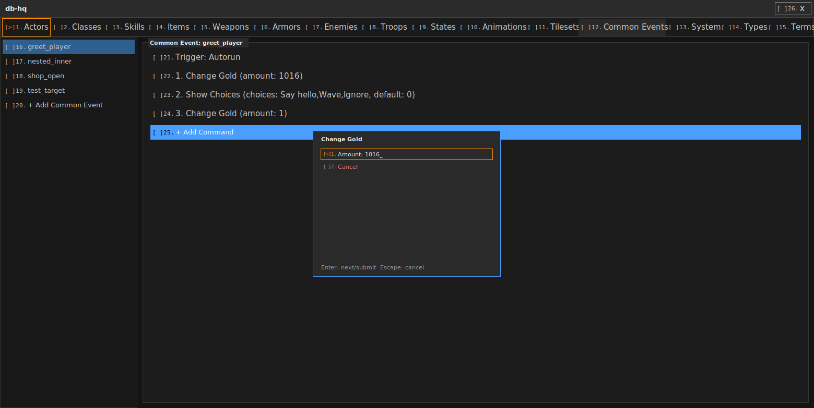

# 🏠️ co-work — house-style C, for you to hand to your own agent 🤖️

This repo is **not code you run** — it's two prompts you paste into
*your own* coding agent (Claude, GPT, whatever), plus the real working
files backing them up. It teaches "house style": small C programs,
plain-text storage, and (optionally) a tiny declarative UI layer. Below
is a glossary of the words your agent will use once it's read these, so
when it says one of them back to you, you know what it means. 🗝️

## 📂 What's here

| File | What it's for |
|---|---|
| `c-house-onboard-agent-prompt.md` | 🧱 Paste this FIRST. Small C "ops," one **manager**, plain-text storage. Works for any project, no UI needed. |
| `c-htpm-agent-onboard-prompt.md` | 🖼️ Paste this SECOND, only if your agent thinks the project needs a real window. Explains **chtpm**/**khtpm** and the pitfall to avoid. |
| `khtpm-core/` | 🧰 The REAL, working parser/draw code (not a toy) — your agent wires this in rather than writing a chtpm parser from scratch. Includes a real example `.chtpm` file, plus two later-reading docs: `GENERIC-CAPABILITIES-PATTERN.md` (how to add new renderer features without special-casing them per app - read this one sooner, it saves a real rewrite) and `CONSOLIDATION-PATTERN.md` (once your own project grows past one binary). |
| `network-browser-demo/` | 🌐 A real, runnable, end-to-end proof of `GENERIC-CAPABILITIES-PATTERN.md` — `sh run.sh` and it actually fetches and renders a real URL. This is the ACTUAL house renderer (`khtpm_core_render.c`, ~18,000 lines) and the real, unmodified manager, launcher, and layout files - not a simplified stand-in. |
| `screenshots/` | 📸 What a real chtpm/khtpm window actually looks like, captured live from the working house (see below). |

## 🗣️ How to actually use this with your agent

1. Open a new chat with your coding agent.
2. Paste the **entire contents** of `c-house-onboard-agent-prompt.md`.
3. Describe your project like normal. Your agent now knows to build small
   ops + a manager + plain text files instead of one big tangled program.
4. **Only if** your agent later says something like "this could use a
   real window" — paste `c-htpm-agent-onboard-prompt.md` too, and point
   it at the `khtpm-core/` folder in this same repo.
5. If your agent ever says it's unsure whether it needs something
   fancier than what's described here, that's a real signal to stop and
   ask a human (you, or whoever gave you this repo) — not to guess.

## 📖 Glossary — words your agent will use once it's read these

- **📄 layout** — the `.chtpm` file itself: a short list of WHAT is in a
  window (a sidebar, a panel, some buttons), never pixel coordinates.
  If your agent says "I'll add that to the layout," it means editing
  this file, not writing new drawing code.
- **⌨️ cli-io** — a real, existing convention for a text-input field:
  click or press Enter/a digit to ARM it, type, Backspace edits, Escape
  cancels, Enter COMMITS (writes the typed line to a file and fires a
  command). If your agent says a field "isn't cli-io," it means the
  field can't be typed into properly yet — that's a real bug to fix,
  not a nitpick.
- **🎛️ manager** — the ONE process allowed to write a given shared state
  file. Everything else (the window, other tools) only ever READS that
  file. If your agent proposes a second thing writing the same file,
  push back — that's the exact bug class this pattern exists to avoid.
- **🔌 op** — one small, single-purpose C program (e.g. `change_gold.c`
  does ONE thing). If your agent says "I'll write a new op for that,"
  it means a new small standalone binary, not a new function bolted
  onto an existing one.
- **🗃️ registry** — a plain-text data file listing "types" or "commands"
  so your C code doesn't have to hardcode them. If your agent says
  "that's a registry entry, not a code change," it means you can add
  the new thing by editing a text file, no recompile.
- **🖼️ chtpm** — the layout FILE FORMAT (see "layout" above).
- **⚙️ khtpm** — the C PROGRAM that reads a `.chtpm` file and draws it,
  handles clicks, and auto-numbers everything for keyboard nav. Your
  agent doesn't write this from scratch — it's in `khtpm-core/`.
- **🔢 nav index / `[>N]` badge** — every clickable thing in a khtpm
  window gets a number automatically (see the screenshots below — the
  `[ ]1.`/`[>]1.` badges). Press the digit + Enter to activate it from
  the keyboard, no mouse needed. If your agent builds something
  clickable with NO number next to it, that's the exact bug this whole
  pattern exists to prevent (see the pitfall section in doc 2).
- **📡 relay** (a.k.a. **text-file input injection**) — a plain text
  file your program tails for input (one line per keypress). Lets you
  (or a testing agent) drive the whole window without a real mouse —
  just append lines to a file. See doc 2's testing section.

## 📸 Screenshots (real, captured live via the relay + a PNG dump — not mockups)

**A real chtpm/khtpm window** — sidebar on the left (`[>]16. greet_player`
is focused, orange outline), a panel on the right showing that item's
real detail, every row auto-numbered for keyboard nav:

**A real "Add Command" popup** — same window, same rules: a real text
field (`cli-io`, note the `_` cursor and orange focus outline) plus a
real, numbered **Cancel** row, not just an Escape shortcut:

Both of these are the SAME pattern your agent will build for you if you
go the chtpm/khtpm route — real layout file, real generic renderer, real
keyboard nav, zero hand-positioned pixels.

---

## 🤔 Why does this repo exist at all?

🎯 **Honest context, not a sales pitch:** this is a **holdover**, not the
final destination. It exists so a new helper/collaborator (or a future
employee) can get productive in "house style" C quickly, without needing
to already know the house inside-out.

The REAL long-term direction — for mainstream/end users, and eventually
for us building the house itself — is **visual scripting** (Scratch-block
and Blueprint-node style editing, not hand-written C) for events, and
over time, for everything. Code + tools like the ones in this repo are
the bridge to get there, not the endpoint. 🌉

🧩 That's exactly WHY this style matters, not despite it:
- Small **ops**, a data-driven **registry** instead of hardcoded logic,
  and a real **layout** file instead of hand-positioned pixels are all
  choices that make code EASY TO READ BACK OUT and re-express visually
  later — a block/node can represent "one op, one registry entry" far
  more easily than it can represent one giant tangled program.
- So: if a helper writes real code using this style, it's not a dead
  end. It should be **somewhat compatible with, or reasonably easy to
  convert into,** the visual-scripting version once that exists — that's
  the whole point of holding this line now instead of letting everyone
  write it however they want.
- 👋 If you're a new helper reading this: you're not being asked to
  learn a whole permanent framework — just enough discipline that your
  work today doesn't become throwaway work later.

---

Have fun! Paste, build, and if your agent gets stuck on the "should we
go fancier here" question — that's your cue to jump in. 🚀
